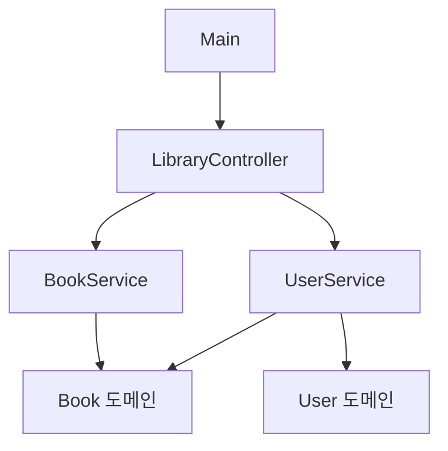
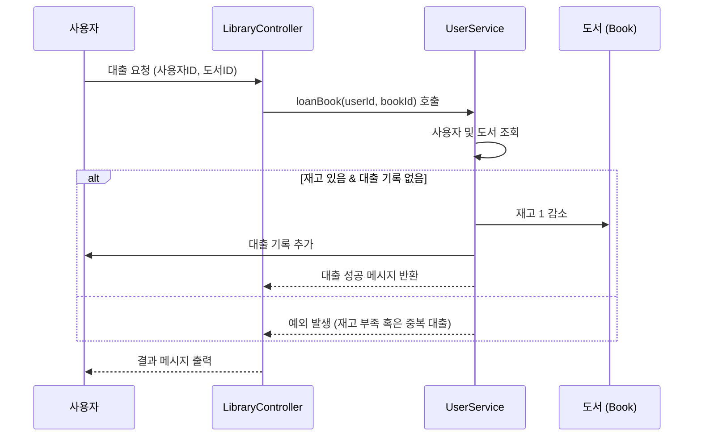

# 도서 관리 시스템

- 이 프로젝트는 콘솔 기반의 도서 관리 시스템으로, 사용자가 도서를 추가, 검색, 대출, 반납 등의 작업을 수행할 수 있다.
- Java Core, 객체지향 설계 원칙, 예외 처리, Stream API 등의 내용을 실제 코드에 적용하여 학습한 내용을 정리했습니다.

---

## 목적

- **Java Core**: 변수, 데이터 타입, 컬렉션, 반복문, Stream API 등 자바 기본 문법 활용
- **객체지향 설계 원칙**: 캡슐화, 상속, 다형성 및 SOLID 원칙을 적용하여 유지보수하기 쉬운 구조 설계
- **예외 처리**: 표준 및 사용자 정의 예외를 통해 안정적인 에러 처리 구현
- **테스트**: (JUnit 등을 활용한 단위 테스트 추가 가능)

---

## 주요 기능

### 도서 관리

- **도서 추가**: 관리자가 도서의 ID, 제목, 저자, ISBN, 카테고리, 가격, 재고 등의 정보를 입력하여 시스템에 등록
- **도서 삭제**: 등록된 도서를 삭제하며, 존재하지 않는 도서의 경우 `BookNotFoundException` 발생
- **도서 검색**: 제목 또는 저자를 기준으로 도서를 검색 (Java Stream API 활용)
- **도서 수정**: 도서의 상세 정보를 업데이트 (제목, 저자, ISBN, 카테고리, 가격, 재고)

### 사용자 관리

- **도서 대출**: 사용자가 도서를 대출하며, 재고가 충분한 경우 대출 진행 및 중복 대출 방지
- **도서 반납**: 대출한 도서를 반납하고, 재고를 복원
- **대출 기록 조회**: 사용자가 대출한 도서 목록을 조회

### 시스템 관리

- **데이터 초기화**: 프로그램 실행 시 예제 사용자 및 도서 데이터를 자동으로 로드
- **에러 처리**: 잘못된 입력, 존재하지 않는 도서/사용자, 재고 부족 등 다양한 상황에 대해 사용자 정의 예외로 처리

---

## 기술 스택

- **Java Core**: 제어문, 컬렉션, Stream API 등
- **객체지향 원칙**: 캡슐화, 상속, 다형성, SOLID 원칙 적용
- **예외 처리**: 표준 예외와 사용자 정의 예외 활용

---

## 아키텍처 다이어그램

## 도서 대출 과정

